# Selenium 활용 로그인 테스트


### 🔹 개요

 Selenium과 Pytest를 활용하여 로그인/로그아웃 기능을 자동화하였고, POM 구조와 데이터 기반 테스트를 적용해 유지보수 가능한 자동화 테스트 기반을 구현했다.

---

### 🔹 목표

- 로그인 기능의 정상 동작 여부를 자동으로 검증한다.
- 잘못된 계정 정보 입력 시 적절한 오류 메시지가 출력되는지 확인한다.
- 로그인 이후 로그아웃 기능이 정상 동작하는지 검증한다.
- 반복 가능한 테스트 환경을 구축하여 수동 테스트의 비효율을 줄인다.
- 실무에서 자주 사용하는 자동화 테스트 구조(POM, fixture, parameterize)를 학습하고 적용한다.

---

### 🔹 테스트 자동화 시나리오 설계

다음과 같은 사용자 흐름을 기준으로 자동화를 설계

1. [https://the-internet.herokuapp.com/login](https://the-internet.herokuapp.com/login) 접속
2. username 타이핑
3. password 타이핑
4. login 버튼 클릭
5. flash 메세지 확인

---

### 🔹 테스트 범위

- 정상 로그인
- 비정상 로그인
    - 잘못된 아이디 입력
    - 잘못된 비밀번호 입력
- 로그아웃
- 플래시 메시지 검증
- URL 이동 검증

---

### 🔹 테스트 설계

#### 📂 Page Object Model(POM) 폴더 구조


1. 설계 방식

테스트는 Page Object Model(POM) 구조를 기반으로 설계하였다.

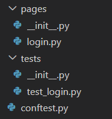

2. 테스트 관점
 - 기능 관점
  사용자가 로그인/로그아웃을 정상 수행할 수 있는가
 - 입력값 검증 관점
  잘못된 입력값에 대해 적절한 에러 메시지가 출력되는가
 - 화면 전이 관점
  로그인 성공/실패에 따라 URL이 기대한 화면으로 이동하는가 
 - 사용자 경험 관점
  시스템이 플래시 메시지로 결과를 명확히 전달하는가

3. 테스트 시나리오
  1. 정상 로그인
        - 올바른 아이디와 비밀번호 입력
        - 로그인 버튼 클릭
        - 성공 메시지 확인
        - /secure URL 이동 확인
  2. 잘못된 아이디 로그인
        - 잘못된 아이디 입력 (공백, 특수문자 등)
        - 올바른 비밀번호 입력
        - 로그인 버튼 클릭
        - 아이디 오류 메시지 확인
        - /login 유지 확인
  3. 잘못된 비밀번호 로그인
        - 올바른 아이디 입력
        - 잘못된 비밀번호 입력
        - 로그인 버튼 클릭
        - 비밀번호 오류 메시지 확인
        - /login 유지 확인
  4. 로그아웃
        - 정상 로그인 수행
        - 로그아웃 버튼 클릭
        - 로그아웃 완료 메시지 확인
        - /login URL 이동 확인
 
---

### 🔹 자동화 구현 과정

#### 🔎 페이지 객체 설계

```python
from selenium import webdriver
from selenium.webdriver.chrome.options import Options
from selenium.webdriver.common.by import By
from selenium.webdriver.common.keys import Keys
from selenium.webdriver.support.ui import WebDriverWait
from selenium.webdriver.support import expected_conditions as EC    # 이름이 길어서 별칭으로 EC
```

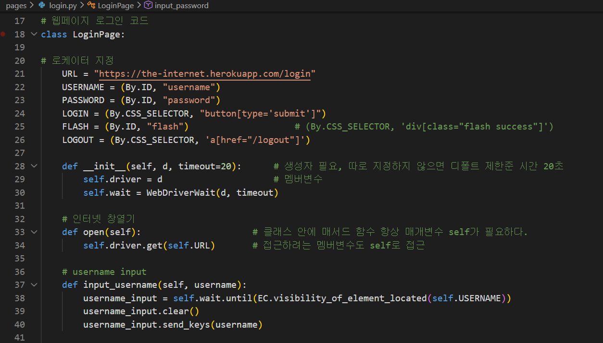

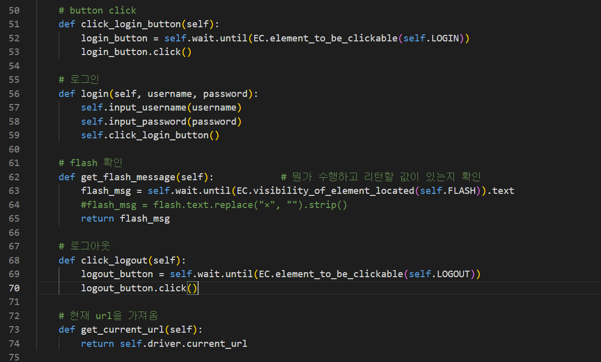

👉 Selenium의 명시적 대기(`WebDriverWait`)를 활용하여 요소가 로드될 때까지 기다린 후 안정적으로 동작하도록 구현했다.

---

#### 🔎 공통 실행 환경 구성

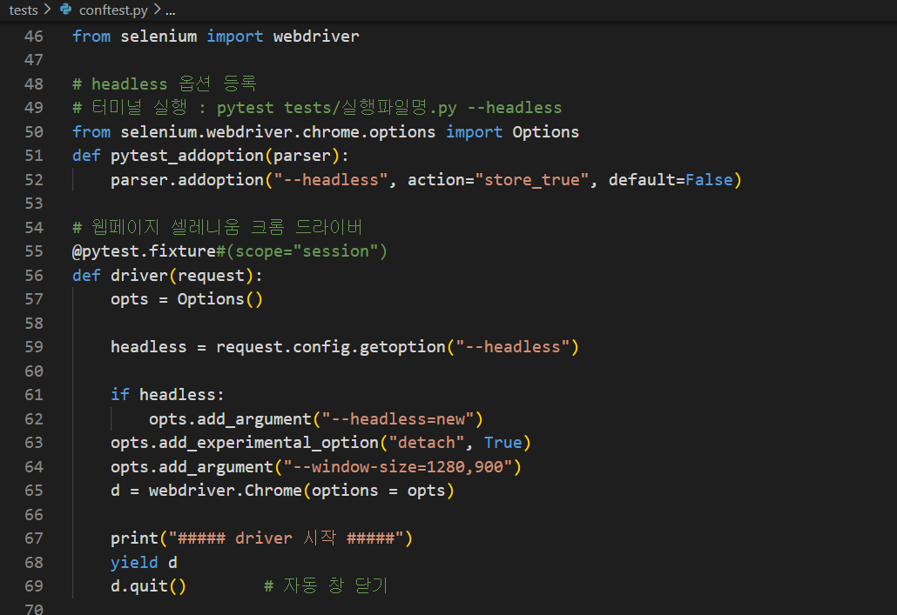

👉`conftest.py`에서 Pytest fixture를 사용해 WebDriver 생성 코드를 공통화하였다. 테스트마다 driver 생성 코드를 반복하지 않도록 하였고, 실행 옵션 변경도 한 곳에서 관리할 수 있게 만들었다.

---

#### 📝 테스트 코드 작성


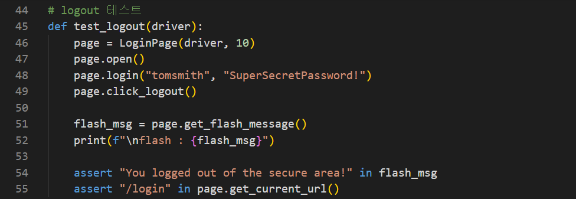


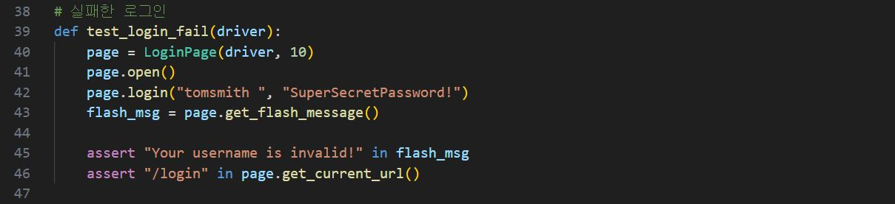

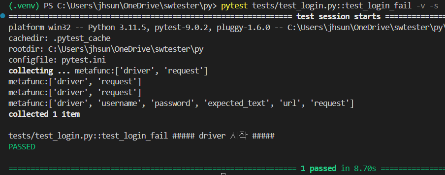

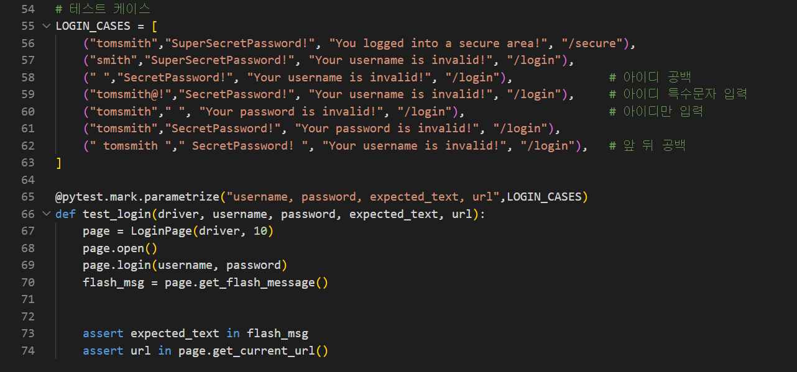

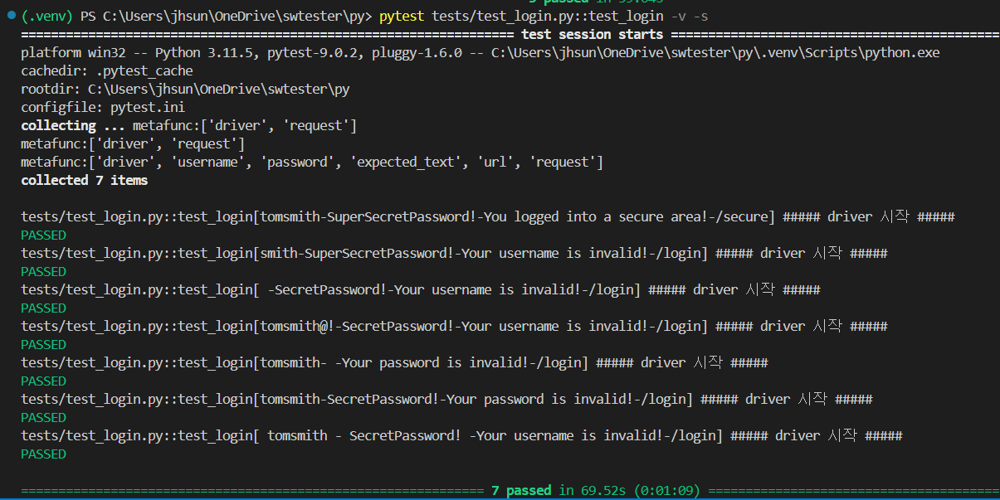


👉 정상적인 로그인, 로그아웃, 로그인 실패를 진행하고 테스트 케이스로 만든 여러 로그인 케이스를 `parameterize`를 사용하여 하나의 테스트 구조로 처리할 수 있게 구현했다.

---

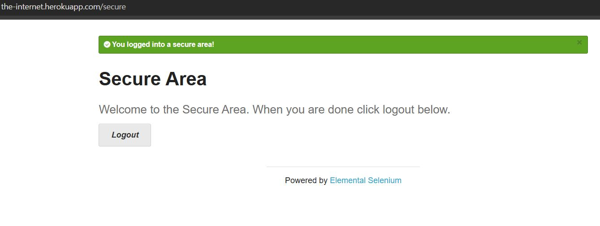

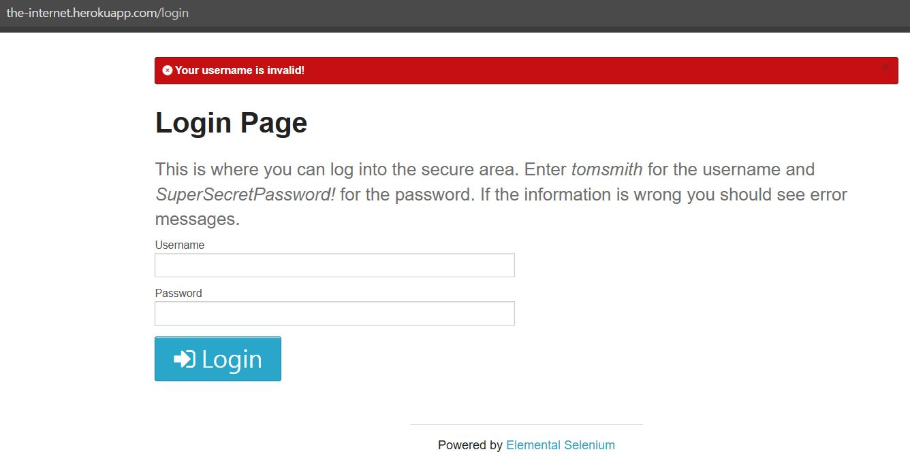


---

### 🔹 결과

- 정상 계정 입력 시 로그인 성공 메시지가 출력되고 `/secure` 페이지로 이동함
- 잘못된 아이디 입력 시 사용자명 오류 메시지가 출력됨
- 잘못된 비밀번호 입력 시 비밀번호 오류 메시지가 출력됨
- 로그인 후 로그아웃 시 로그아웃 완료 메시지가 출력되고 `/login` 페이지로 이동함

👉 페이지 객체, 공통 fixture, 데이터 기반 테스트 구조로 나누어 작성함으로써 재사용성과 가독성을 높인 자동화 구조를 구현했다.

---

### 🎯 프로젝트를 통해 배운 점

- 테스트 코드와 페이지 동작 코드를 분리하는 설계 방법
- 공통 환경을 fixture로 관리하는 방법
- 반복되는 테스트를 parameterize로 줄이는 방법
- 자동화 테스트에서도 가독성과 구조화가 중요하다는 점

👉 이 프로젝트를 통해 Selenium 문법을 익히고, 자동화 테스트는 **유지보수 가능한 테스트 구조를 설계하는 작업**이라는 점을 배울 수 있었다.
